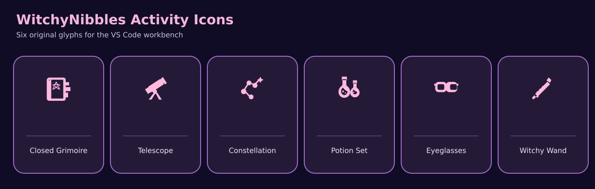
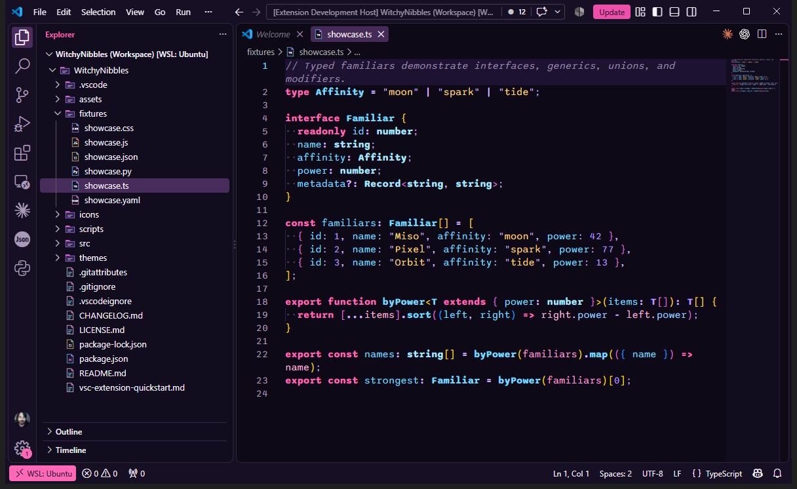
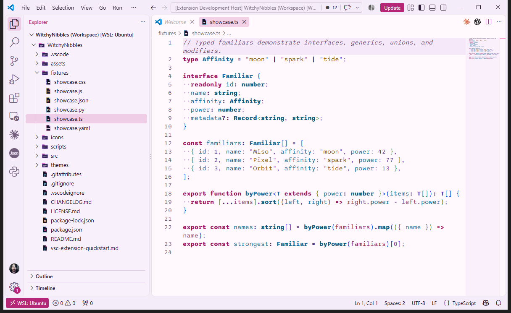
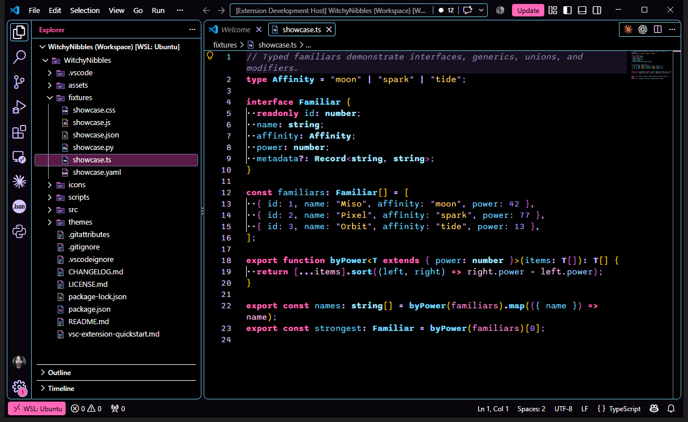

# WitchyNibbles Spellbound Themes

A coordinated VS Code collection with three color themes, matching file icons, and an original product icon font.

## Choose an atmosphere

- **Moonlit:** dark aubergine surfaces with lavender neon accents.
- **Daydream:** pale lilac surfaces with deep purple text.
- **Coven Contrast:** high contrast dark surfaces with clear focus states.

## Install

Download a VSIX from [GitHub Releases](https://github.com/WitchyNibbles/Spellbound-Themes/releases), or build one with `npm run package`, then use **Extensions: Install from VSIX...** in VS Code. After installation select the WitchyNibbles color, file icon, and product icon themes from the Command Palette.

## Original product icons

Version 1.2.1 includes 48 original WitchyNibbles SVG glyphs in a custom font. Six signature Activity Bar icons are:

- **Explorer:** closed grimoire with a pentagram and sticky notes.
- **Search:** detailed telescope.
- **Source Control:** constellation of connected stars.
- **Run and Debug:** a set of potion bottles.
- **Extensions:** a pair of eyeglasses.
- **Manage:** a witch's wand with spell details.

The remaining controls keep familiar silhouettes while using the same clean, monochrome witchy visual language. Product icon fonts are monochrome; VS Code colors glyphs using the active color theme.



## Color theme previews







## Build locally

```sh
npm install
npm run validate
npm run package
```

The package command creates a VSIX; it does not publish to the Marketplace. This project is published at the root of the public [Spellbound-Themes repository](https://github.com/WitchyNibbles/Spellbound-Themes), where the extension page serves its screenshots from `assets/screenshots/`.

## License

MIT. [LICENSE.md](LICENSE.md).
